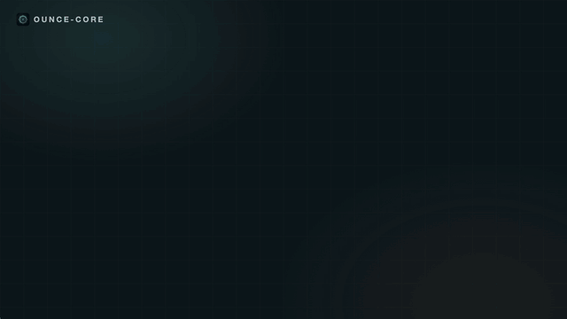
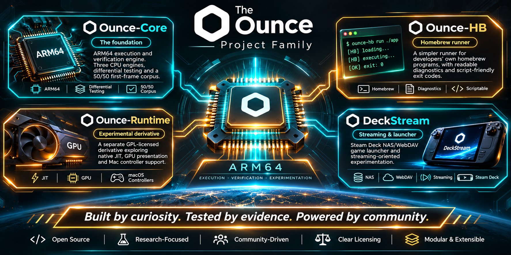

<div align="center">

# Does your code behave the same on ARM64?

Ounce-Core runs a program on three CPU engines and compares the output with real ARM64 hardware.

[](https://github.com/hffgzktbcc-blip/ounce-core/actions/workflows/ci.yml)
[](docs/DETAILS.md#legacy-switch-regression-corpus)
[](LICENSE)

[](docs/media/ounce-core-main.mp4)

<sub>[Watch the full 90-second video](docs/media/ounce-core-main.mp4)</sub>

**[Try it in your browser](https://hffgzktbcc-blip.github.io/ounce-core/playground/)**

</div>

## What it is

You ship a library built on x86. Will it give the same answer on ARM64? You may not own an ARM64 machine to find out.

Ounce-Core runs the program and diffs its output byte for byte against a reference recorded on real ARM64 hardware. When the two differ, it helps you find where they split. It is open source and written in Rust. The [vision](docs/VISION.md) explains the aim.

## What it has done

- **It found real bugs.** In one week of running unmodified open-source programs (LZ4, xxHash, SQLite, Lua) against an Apple Silicon Mac, it found a prefetch instruction that corrupted registers, two floating-point instructions with the wrong sign (so `sin`, `cos` and `pow` returned wrong values), and many missing vector instructions. All were fixed, each with a test.
- **It agrees with the hardware on real programs.** LZ4, xxHash, SQLite 3.50.4, Lua 5.4.7 and a 5,964-line floating-point test give byte-identical output on Tier-3, Tier-4 and native. 18 programs also run as static Linux ARM64 programs and match a host build and qemu-user. The first-frame corpus of <!-- corpus-headline -->50/50<!-- /corpus-headline --> outside programs passes its pixel checks, on the inputs those checks cover.
- **It is safe Rust.** The runtime in `src/` forbids `unsafe` code, and the compiler enforces it. The two small crates that need `unsafe` are kept apart, and CI checks the boundary.

**Limit:** this is a testing tool, not a fast emulator. It does not run arbitrary programs, instruction coverage is partial, and a match is evidence for the inputs tested, not proof ([limits](docs/LIMITS.md)).

## The Growing Family

<p align="center">
  
</p>

> *Built by curiosity. Tested by evidence. Powered by community.*

Four independent, open-source projects sharing a development philosophy, an evidence-first discipline, and an active community:

| Project | What it is for | When to choose it | Licence | Link |
| :--- | :--- | :--- | :--- | :--- |
| **ounce-core** (this repo) | ARM64 execution and verification research engine. Runs programs across three CPU tiers and compares output with real hardware. | You want evidence-first correctness, hardware differential checks, or the safe-Rust core. | MIT | You are here |
| **ounce-hb** | Simplified homebrew runner built around Ounce-Core with diagnostics and exit codes. | You want a turn-key CLI to run and diagnose homebrew with stable exit codes and plain-language failure explanations. | MIT | [ounce-hb](https://github.com/hffgzktbcc-blip/ounce-hb) |
| **ounce-runtime** | Experimental performance runtime with native JIT and GPU development. | You want high performance, visual presentation via Metal/Vulkan/DX12, or controller input under GPL-3.0 terms. | GPL-3.0-or-later | [ounce-runtime](https://github.com/hffgzktbcc-blip/ounce-runtime) |
| **deckstream** | Steam Deck NAS/WebDAV game launcher and streaming experimentation. | You want an on-demand virtual filesystem for handheld Linux gaming PCs (SteamOS) with Gaming Mode integration. | MIT | [deckstream](https://github.com/hffgzktbcc-blip/deckstream) |

**Independent siblings, clean boundaries.** Each project solves a distinct problem with its own repository, tests, and releases. DeckStream is an independent sibling, not an Ounce-Core derivative; no code flows inappropriately across licensing boundaries (`ounce-core`, `ounce-hb`, and `deckstream` are MIT; `ounce-runtime` is GPL-3.0-or-later).

## Try it

**1. In your browser.** Step through ARM64 code one instruction at a time in the [playground](https://hffgzktbcc-blip.github.io/ounce-core/playground/). Nothing to install.

**2. On your machine.** You need Rust 1.85 or newer. On Debian or Ubuntu, first run `sudo apt-get install -y libasound2-dev libudev-dev`.

```bash
git clone https://github.com/hffgzktbcc-blip/ounce-core.git && cd ounce-core
cargo build --release
cargo run --release -- run tests/fixtures/nro/hello/hello.nro fixture
```

The last command runs a small test program and prints `result=0x00000EEE`. To check your own program against a host build, see [Add a program](docs/ADD_A_PROGRAM.md). To find where a run first goes wrong, see the [diagnosis guide](docs/DIAGNOSIS_CLI.md).

**3. Help out.** Have an ARM64 Mac, Raspberry Pi or Linux VM? Run `python3 scripts/verify_differential.py --json my-results.json` and report it in [issue #248](https://github.com/hffgzktbcc-blip/ounce-core/issues/248). No ARM64 machine? Pick a [no-code task](docs/community/TRY_THIS_WEEK.md) or a [good first issue](https://github.com/hffgzktbcc-blip/ounce-core/contribute). Read [CONTRIBUTING.md](CONTRIBUTING.md) before opening a pull request.

## More

- [Details](docs/DETAILS.md): subsystem status, how the proof works, test harness, full commands, roadmap, repository layout
- [Reproduce the results](docs/REPRODUCE.md) and [what they do not show](docs/LIMITS.md)
- [Research paper](site/research.html) and [vision](docs/VISION.md)
- [Mac app](docs/MAC_APP.md) and [interactive lab](docs/INTERACTIVE_LAB.md)
- [Sources, provenance and legal notice](docs/DETAILS.md#responsible-research-and-legal)
- Came here for the Switch emulator? [What changed and why](https://github.com/hffgzktbcc-blip/ounce-core/discussions/330)

Ounce-Core is not affiliated with Nintendo or NVIDIA. It loads homebrew and synthetic programs only. The only source of this project is this repository, so build from source. Licensed under [MIT](LICENSE).
